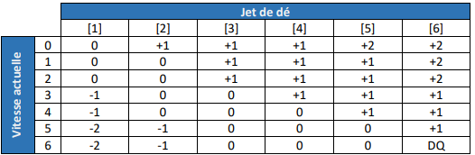

# Simulateur de course de trot attelé

Ce programme permet de jouer à un simulateur de course de trot attelé. La course se déroule au tour par tour, l'avancée
des chevaux se fait aléatoirement basé sur un jet de dé à chaque tour.
Deux variantes sont proposées : une version texte et une version plus graphique.

## Table des matières
- [Installation](#installation)
- [Utilisation](#utilisation)
- [Règles du jeu](#règles-du-jeu)
- [Fonctionnalités](#fonctionnalités)
- [Structure du code](#structure-du-code)

# Installation

1. Assurez-vous d’avoir **Python 3** installé sur votre machine.
2. Téléchargez le fichier `harness_racing_simulator.py` dans un répertoire de votre choix.
3. Ouvrez un terminal et exécutez le script : `python harness_racing_simulator.py`

# Utilisation

Lancer le script.

Choisissez le nombre de chevaux **(de 12 à 20)** ainsi que le type de course **(tiercé, quarté, quinté)**.  
La course démarre, appuyer sur entrée pour faire avancer la course d'un tour.

# Règles du jeu

A chaque tour, un dé est jeté pour chaque cheval, il avancera (ou pas) selon le tableau ci-dessous :

Lorsque qu'un cheval passe la ligne d'arrivée, il a gagné. S'il dépasse le trot en terme de vitesse il est disqualifié.

# Fonctionnalités

Propose deux variantes: une version texte et une version graphique du jeu.
Choix du type de course **(tiercé, quarté, quinté)**. 
Choix du nombre de chevaux  **(de 12 à 20)**.

# Structure du code

- **`cross_multiplication(a, b, c)`**  
  Fait un produit en croix \((b \times c) / a\) et renvoie le résultat **arrondi à l’inférieur** (`floor`). Sert ici à convertir une distance (en m) vers une échelle d’affichage (en caractères).

- **`start_game_graphical(horses, race_type)`**  
  Lance la **simulation graphique** (ASCII) d’une course de trot attelé sur 2400 m.  
  À chaque tour (10 s simulées) : met à jour la vitesse selon un jet de dé, avance chaque cheval, gère disqualifications et arrivées, affiche une barre avec la position (`♘`) et annonce l’état de chaque cheval.  
  Arrête quand tous les chevaux sauf les disqualifiés ont franchi la ligne, puis affiche le **tiercé/quarté/quinté** suivant le `race_type`.

- **`init_game(num_horses, gui=False)`**  
  Initialise la course : crée la liste des chevaux via `init_horses`, demande le type de course avec `ask_horse_race_type`, puis lance soit la **version graphique** (`start_game_graphical`) si `gui=True`, soit la **version texte** (`start_game`).

- **`change_speed(speed, die_roll)`**  
  Renvoie la **variation de vitesse** (peut être négative, nulle, positive ou `None`) en consultant le tableau `SPEED_CHART` selon la vitesse actuelle et le résultat d’un dé à 6 faces.

- **`roll_die(die_size)`**  
  Simule un **lancer de dé** à `die_size` faces et renvoie une valeur entière uniforme entre `1` et `die_size`.

- **`next_turn()`**  
  Met la simulation en **pause** jusqu’à ce que l’utilisateur appuie sur *Entrée* (permet d’avancer tour par tour).

- **`start_game(horses, race_type)`**  
  Lance la **simulation en version texte** (sans la barre de progression graphique).  
  À chaque tour : calcule les changements de vitesse, avance les chevaux via `DISTANCE_CHART`, gère disqualifications/arrivées, affiche l’état, attend *Entrée* avec `next_turn`.  
  À la fin, annonce le **tiercé/quarté/quinté** en fonction de `race_type`.

- **`init_horses(num_horses)`**  
  Crée et renvoie la **liste des chevaux** (dictionnaires) initialisés : vitesse 0, non disqualifiés, distance 0, non arrivés, identifiant 1..`num_horses`, et couleur par défaut pour l’affichage.

- **`ask_horse_race_type()`**  
  Demande à l’utilisateur le **type de course** (`"tierce"`, `"quarte"`, `"quinte"`). Repose la question tant que l’entrée n’est pas valide. Renvoie la chaîne choisie.

